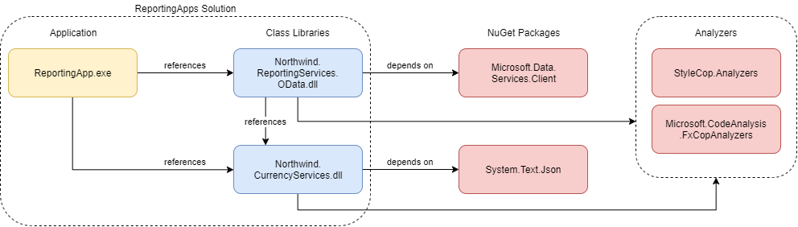
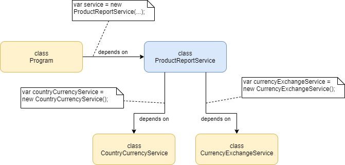
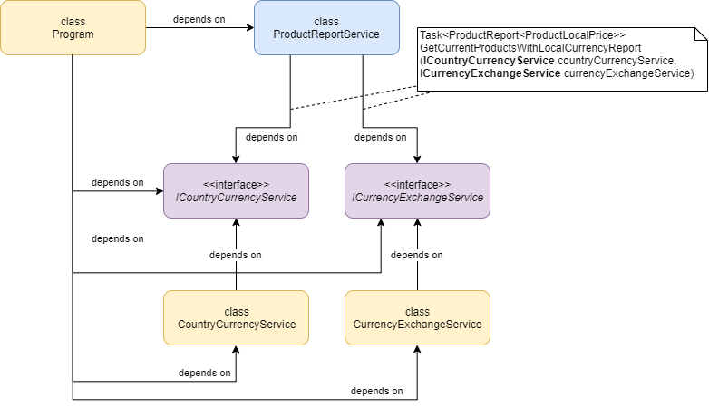
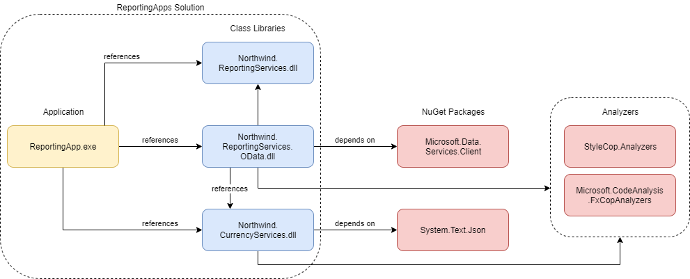
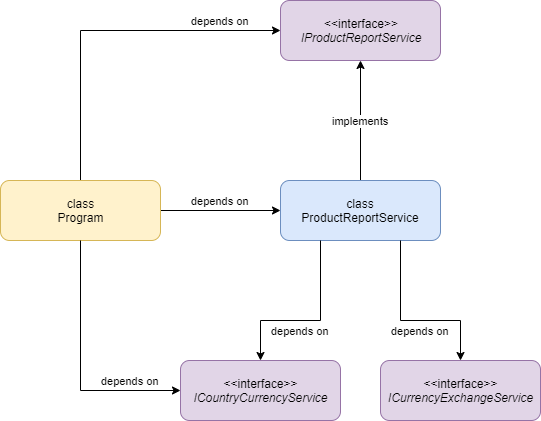
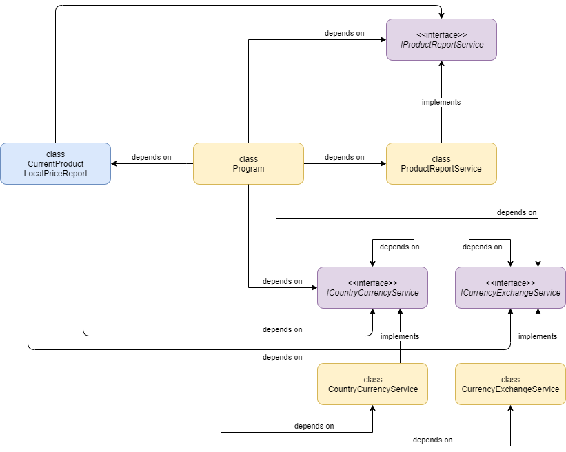
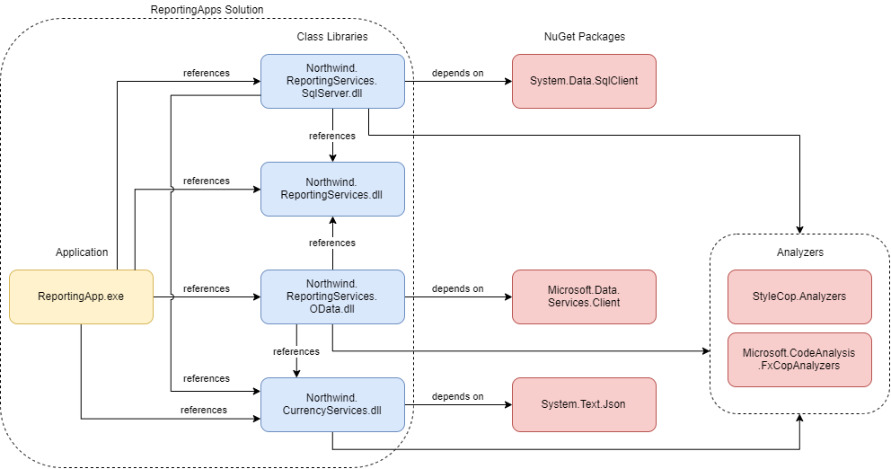

# Northwind Applications

## Модуль 3. Запросы к сервисам данных

[WCF](https://docs.microsoft.com/en-us/dotnet/framework/wcf/) - это фреймворк, который в прошлом широко использовался для [построения распределенных приложений](http://sergeyteplyakov.blogspot.com/2011/02/wcf.html) на базе платформы .NET. Существует много рабочих приложений, которые построены на его основе и успешно работают. На текущий момент [популярность фреймворка сильно упала](https://github.com/dotnet/wcf/issues/1784), однако поддержка работающих сервисов и работа с ними по-прежнему является актуальной задачей для крупных промышленных программных систем.

URL [Northwind (v3)](https://www.odata.org/odata-services/) OData-сервиса выглядит следующим образом:

```
https://services.odata.org/V3/Northwind/Northwind.svc/
```

Наличие [".svc" в пути сервиса](https://stackoverflow.com/questions/17363429/does-a-wcf-service-always-use-an-svc-file) намекает на реализацию сервиса с помощью WCF.

### Цель

* Научиться использовать LINQ для построения запросов данных.
* Научиться использовать Fiddler для инспекции HTTP/HTTPS-трафика.
* Научиться получать данные из внешних REST-сервисов, используя _HttpClient_.
* Научиться десериализовывать поток данных, используя _JsonSerializer_.


### Задание 1. Создание каркаса приложения отчетов

Научитесь создавать консольные приложения .NET Core с подключенными статическими анализаторами кода.

#### Выполнение

1. Создайте консольное приложение _ReportingApp_ и библиотеку классов _Northwind.ReportingServices.OData_ в решении _ReportingApps_.


```sh
$ mkdir ReportingApps
$ cd ReportingApps
$ dotnet new sln --name ReportingApps
$ dotnet new classlib --name Northwind.ReportingServices.OData
$ dotnet sln ReportingApps.sln add Northwind.ReportingServices.OData\Northwind.ReportingServices.OData.csproj
$ dotnet new console --name ReportingApp
$ dotnet sln ReportingApps.sln add ReportingApp\ReportingApp.csproj
$ dotnet add ReportingApp\ReportingApp.csproj reference Northwind.ReportingServices.OData\Northwind.ReportingServices.OData.csproj
```

2. Добавьте в проекты статические анализаторы кода.

```sh
$ dotnet add Northwind.ReportingServices.OData\Northwind.ReportingServices.OData.csproj package Microsoft.CodeAnalysis.FxCopAnalyzers
$ dotnet add Northwind.ReportingServices.OData\Northwind.ReportingServices.OData.csproj package StyleCop.Analyzers
$ dotnet add ReportingApp\ReportingApp.csproj package Microsoft.CodeAnalysis.FxCopAnalyzers
$ dotnet add ReportingApp\ReportingApp.csproj package StyleCop.Analyzers
```

3. Создайте пустые файлы настроек IDE и статических анализаторов кода.

> Для linux-систем и Git Bash нужно использовать команду _touch_ вместо команды Windows _type_.

```sh
$ type nul > .\code-analysis.ruleset
$ type nul > .\stylecop.json
$ type nul > .\.editorconfig
$ type nul > Northwind.ReportingServices.OData\.editorconfig
$ type nul > ReportingApp\.editorconfig
```

Заполните содержимое - [code-analysis.ruleset](ReportingApps/code-analysis.ruleset), [stylecop.json](ReportingApps/stylecop.json), [.editorconfig решения](ReportingApps/.editorconfig) и [.editorconfig проектов](ReportingApps/ReportingApp/.editorconfig).

4. Добавьте в файлы проектов ссылки на файлы настроек и подключите статические анализаторы кода:

```xml
<PropertyGroup>
  <CodeAnalysisRuleSet>..\code-analysis.ruleset</CodeAnalysisRuleSet>
  <GenerateDocumentationFile>true</GenerateDocumentationFile>
  <NoWarn>$(NoWarn),1573,1591,1712</NoWarn>
</PropertyGroup>
<ItemGroup>
  <AdditionalFiles Include="..\code-analysis.ruleset" Link="Properties\code-analysis.ruleset" />
  <AdditionalFiles Include="..\stylecop.json" Link="Properties\stylecop.json" />
</ItemGroup>
```

5. Добавьте в _Northwind.ReportingServices.OData_ код OData-клиента для сервиса [Northwind (v3)](https://www.odata.org/odata-services/).

6. Создайте пустые файлы для сервиса отчетов _ProductReportService_ в каталоге _ProductReports_.

```sh
$ mkdir Northwind.ReportingServices.OData\ProductReports
$ type nul > Northwind.ReportingServices.OData\ProductReports\ProductPrice.cs
$ type nul > Northwind.ReportingServices.OData\ProductReports\ProductReport.cs
$ type nul > Northwind.ReportingServices.OData\ProductReports\ProductReportService.cs
```
Заполните содержимое - [ProductPrice.cs](ReportingApps/Northwind.ReportingServices.OData/ProductReports/ProductPrice.cs), [ProductReport.cs](ReportingApps/Northwind.ReportingServices.OData/ProductReports/ProductReport.cs), [ProductReportService.cs](ReportingApps/Northwind.ReportingServices.OData/ProductReports/ProductReportService.cs). Замените _Program.cs_ на [Program.cs](ReportingApps/ReportingApp/Program.cs).

Проект должен выглядеть следующим образом - [ReportingApps](ReportingApps/).


### Задание 2. Работа с Fiddler

Освойте базовые функции Fiddler.

#### Выполнение

1. Скачайте и установите [Fiddler](https://www.telerik.com/fiddler).
2. Изучите:
	* [Скриптуемый отладочный прокси Fiddler](https://learn.javascript.ru/fiddler).
	* [Getting Started with Fiddler Web Debugging Proxy](https://www.youtube.com/watch?v=gujBKFGwjd4).
	* Дополнительно: [Fiddler - подробный разбор](https://www.youtube.com/watch?v=YPg18W7O8aU).


### Задание 3. LINQ-запросы для OData-сервисов

Научитесь использовать LINQ для создания запросов к OData-сервисам.

#### Выполнение

1. Изучите статьи про асинхронную работу с сервисом:
	* [Asynchronous Operations](https://docs.microsoft.com/en-us/dotnet/framework/data/wcf/asynchronous-operations-wcf-data-services)
	* [How to: Execute Asynchronous Data Service Queries](https://docs.microsoft.com/en-us/dotnet/framework/data/wcf/how-to-execute-asynchronous-data-service-queries-wcf-data-services)

Получите данные по товарам - замените код _ProductReportService.GetCurrentProductsReport_:

```cs
public async Task<ProductReport<ProductPrice>> GetCurrentProductsReport()
{
    var query = (DataServiceQuery<NorthwindProduct>)this.entities.Products;

    var result = await Task<IEnumerable<NorthwindProduct>>.Factory.FromAsync(query.BeginExecute(null, null), (ar) =>
    {
        return query.EndExecute(ar);
    });

    var productPrices = new List<ProductPrice>();
    foreach (var product in result)
    {
        productPrices.Add(new ProductPrice
        {
            Name = product.ProductName,
            Price = product.UnitPrice ?? 0,
        });
    }

    return new ProductReport<ProductPrice>(productPrices);
}
```

Запустите приложение и найдите в Fiddler соответствующий запрос.

2. Изучите статьи про запросы данных из сервиса: 
	* [Querying the Data Service](https://docs.microsoft.com/en-us/dotnet/framework/data/wcf/querying-the-data-service-wcf-data-services).
	* [How to: Execute Data Service Queries](https://docs.microsoft.com/en-us/dotnet/framework/data/wcf/how-to-execute-data-service-queries-wcf-data-services).

Напишите LINQ-запрос для выборки всех текущих товаров (не discontinued) и сделайте нисходящую сортировку списка по полю _ProductName_:

```cs
var query = (DataServiceQuery<NorthwindProduct>)this.entities.Products.Where(p => !p.Discontinued).OrderBy(p => p.ProductName);
```

Исследуйте в Fiddler соответствующий запрос.

3. Изучите статью [LINQ Considerations](https://docs.microsoft.com/en-us/dotnet/framework/data/wcf/linq-considerations-wcf-data-services) и перепишите запрос с применением синтаксиса запроса:

```cs
var query = (DataServiceQuery<NorthwindProduct>)(
                from p in this.entities.Products
                where !p.Discontinued
                orderby p.ProductName
                select p);
```

Найдите в Fiddler ответ сервиса в XML-формате.

4. Изучите статью [Query Projections](https://docs.microsoft.com/en-us/dotnet/framework/data/wcf/query-projections-wcf-data-services).

Используйте проекцию для получения имени и цены единицы товара:

```cs
public async Task<ProductReport<ProductPrice>> GetCurrentProductsReport()
{
    var query = (DataServiceQuery<ProductPrice>)(
        from p in this.entities.Products
        where !p.Discontinued
        orderby p.ProductName
        select new ProductPrice
        {
            Name = p.ProductName,
            Price = p.UnitPrice ?? 0,
        });

    var result = await Task<IEnumerable<ProductPrice>>.Factory.FromAsync(query.BeginExecute(null, null), (ar) =>
    {
        return query.EndExecute(ar);
    });

    return new ProductReport<ProductPrice>(result);
}
```

Найдите в Fiddler ответ сервиса и сравните с предыдущим запросом.

5. Реализуйте метод _ProductReportService.GetMostExpensiveProductsReport_.

Используйте проекцию _ProductPrice_ вместо _NorthwindProduct_:

```cs
var query = (DataServiceQuery<NorthwindProduct>)this.entities.Products.
    Where(p => p.UnitPrice != null).
    OrderByDescending(p => p.UnitPrice.Value).
    Take(count);
```

6. Метод _ProductReportService.GetCurrentProductsReport_ возвращает неполный список товаров. Количество элементов в списке ограничено количеством элементов, которое сервис возвращает за один запрос. См. статьи [Loading Deferred Content](https://docs.microsoft.com/en-us/dotnet/framework/data/wcf/loading-deferred-content-wcf-data-services) и [How to: Load Paged Results](https://docs.microsoft.com/en-us/dotnet/framework/data/wcf/how-to-load-paged-results-wcf-data-services). Используйте метод [GetContinuation](https://docs.microsoft.com/en-us/dotnet/api/system.data.services.client.queryoperationresponse-1.getcontinuation), чтобы получить полный список товаров из сервиса.

Найдите в Fiddler соответствующие запросы.


### Задание 4. Дополнительные отчеты

Добавьте в приложение дополнительные отчеты.

#### Выполнение

1. Добавьте новый отчет "price-less-then-products", который будет возвращать текущие товары с ценой меньше указанной в параметрах.

Пример использования:

```sh
$ .\ReportingApp.exe price-less-then-products 20.00
Report - products with price less then 20.00:
Product2, 10.01
Product1, 15.00
```

2. Добавьте новый отчет "price-between-products", который будет возвращать текущие товары с ценой, которая находится между нижним и верхним параметром.

Пример использования:

```sh
$ .\ReportingApp.exe price-between-products 20.05 60.05
Report - products with price between 20.05 and 60.05:
Product1, 21.15
Product3, 34.01
Product1, 59.00
```

3. Добавьте новый отчет "price-above-average-products", который будет возвращать текущие товары с ценой, которая выше средней цены всех товаров.

Пример использования:

```sh
$ .\ReportingApp.exe price-above-average-products
Report - products with price above average:
Product2, 84.91
Product1, 68.93
Product3, 59.01
```

4. Добавьте новый отчет "units-in-stock-deficit", который будет возвращать список всех товаров для которых количество UnitsInStock будет меньше чем количество UnitsOnOrder.

5. Придумайте и реализуйте 3 дополнительных отчета, для реализации который примените неиспользованные методы LINQ.


### Задание 5. REST-сервисы

Добавьте в приложение новый отчет, который будет отображать список текущих товаров с указанием цены товара в локальной валюте страны происхождения поставщика товара. Сервис Northwind предоставляет информацию о цене товара в долларах. Используйте сервис [RestCountries](http://restcountries.eu/), чтобы получить данные о стране, в том числе локальную валюту. Для получения актуальных курсов валют используйте сервис [CurrencyLayer](https://currencylayer.com/) (для доступа к сервису необходима регистрация). Механику работы с сервисами см. в статье [Осваиваем async/await на реальном примере](https://habr.com/ru/company/ruvds/blog/436884/).

#### Выполнение

1. Добавьте библиотеку классов _Northwind.CurrencyServices_ и подключите анализаторы кода.



```sh
$ dotnet new classlib --name Northwind.CurrencyServices
$ dotnet sln ReportingApps.sln add Northwind.CurrencyServices\Northwind.CurrencyServices.csproj
$ dotnet add ReportingApp\ReportingApp.csproj reference Northwind.CurrencyServices\Northwind.CurrencyServices.csproj
$ dotnet add Northwind.ReportingServices.OData\Northwind.ReportingServices.OData.csproj reference Northwind.CurrencyServices\Northwind.CurrencyServices.csproj
$ dotnet add Northwind.CurrencyServices\Northwind.CurrencyServices.csproj package System.Text.Json
$ dotnet add Northwind.CurrencyServices\Northwind.CurrencyServices.csproj package Microsoft.CodeAnalysis.FxCopAnalyzers
$ dotnet add Northwind.CurrencyServices\Northwind.CurrencyServices.csproj package StyleCop.Analyzers
```

Измените _Northwind.CurrencyServices.csproj_, чтобы включить анализаторы кода и добавьте в проект _.editorconfig_.

2. Создайте пустые файлы для новых сервисов.

```sh
$ mkdir Northwind.CurrencyServices\CurrencyExchange
$ type nul > Northwind.CurrencyServices\CurrencyExchange\CurrencyExchangeService.cs
$ mkdir Northwind.CurrencyServices\CountryCurrency
$ type nul > Northwind.CurrencyServices\CountryCurrency\LocalCurrency.cs
$ type nul > Northwind.CurrencyServices\CountryCurrency\CountryCurrencyService.cs
$ type nul > Northwind.ReportingServices.OData\ProductReports\ProductLocalPrice.cs
```

3. Реализуйте сервис _CurrencyExchangeService_, который будет получать актуальные данные курсов обмена валют из сервиса [CurrencyLayer](https://currencylayer.com/).

Добавьте код в _CurrencyExchangeService.cs_:

```cs
public class CurrencyExchangeService
{
    private readonly string accessKey;

    public CurrencyExchangeService(string accesskey)
    {
       this.accessKey = !string.IsNullOrWhiteSpace(accesskey) ? accesskey : throw new ArgumentException("Access key is invalid.", nameof(accesskey));
    }

    public async Task<decimal> GetCurrencyExchangeRate(string baseCurrency, string exchangeCurrency)
    {
        throw new NotImplementedException("Implement GetCurrencyExchangeRate.");
    }
}
```

Изучите статьи:
* [REST client](https://docs.microsoft.com/en-us/dotnet/csharp/tutorials/console-webapiclient).
* [How to serialize and deserialize JSON in .NET](https://docs.microsoft.com/en-us/dotnet/standard/serialization/system-text-json-how-to).

Добавьте реализацию сервиса. Используйте _HttpClient_ и _JsonSerializer_, чтобы получить и обработать данные сервиса _CurrencyLayer_.

4. Реализуйте сервис _CountryCurrencyService_, который должен возвращать данные локальных валют по имени страны из сервиса [RestCountries](http://restcountries.eu/).

Добавьте код в _LocalCurrency.cs_:

```cs
public class LocalCurrency
{
    public string CountryName { get; set; }
    public string CurrencyCode { get; set; }
    public string CurrencySymbol { get; set; }
}
```

Добавьте код в _CountryCurrencyService.cs_:

```cs
public class CountryCurrencyService
{
    public async Task<LocalCurrency> GetLocalCurrencyByCountry(string countryName)
    {
    	throw new NotImplementedException("Implement GetLocalCurrencyByCountry.");
    }
}
```

Добавьте реализацию сервиса. Используйте _HttpClient_ и _JsonSerializer_, чтобы получить и обработать данные сервиса _CurrencyLayer_.

5. Добавьте в класс _ProductReportService_ поддержку нового отчета, который будет возвращать данные продуктов с указанием их локальных цен.

Добавьте код в _ProductLocalPrice.cs_:

```cs
public class ProductLocalPrice
{
    public string Name { get; set; }
    public decimal Price { get; set; }
    public string Country { get; set; }
    public decimal LocalPrice { get; set; }
    public string CurrencySymbol { get; set; }
}
```

Добавьте новый метод в _ProductReportService_:

```cs
public async Task<ProductReport<ProductLocalPrice>> GetCurrentProductsWithLocalCurrencyReport()
{
    var countryCurrencyService = new CountryCurrencyService();
    var currencyExchangeService = new CurrencyExchangeService("<your api-key>");

    throw new NotImplementedException("Implement GetCurrentProductsWithLocalCurrencyReport.");
}
```

Реализуйте _GetCurrentProductsWithLocalCurrencyReport_.

7. Добавьте в класс _Program_ поддержку нового отчета с именем "current-products-local-prices".

Отчет должен выводить:
* Название товара.
* Цену товара в долларах.
* Полное название страны производителя (из внешнего сервиса).
* Цену товара в локальной валюте страны производителя.
* Символ валюты страны производителя (большинство символов будет выведено на консоль как "?").

Пример использования:

```sh
$ .\ReportingApp.exe current-products-local-prices
Report - current products with local price:
Aniseed Syrup, 10$, United Kingdom of Great Britain and Northern Ireland, 08?
Boston Crab Meat, 18$, United States of America, 18$
Camembert Pierrot, 34$, France, 31?
Carnarvon Tigers, 63$, Australia, 93$
Chai, 18$, United Kingdom of Great Britain and Northern Ireland, 14?
...
```


### Задание 6. Внедрение зависимостей

#### Выполнение

1. Проанализируйте зависимости класса _ProductReportService_. См. статью [Understanding Dependencies](https://habr.com/ru/post/349836/):



Какие зависимости имеет класс _ProductReportService_?

2. Добавьте интерфейсы для сервисов _CountryCurrencyService_ и _CurrencyExchangeService_. См. рефакторинг [Извлечение интерфейса](https://refactoring.guru/ru/extract-interface).

```sh
$ type nul > Northwind.CurrencyServices\CurrencyExchange\ICurrencyExchangeService.cs
$ type nul > Northwind.CurrencyServices\CountryCurrency\ICountryCurrencyService.cs
```

Добавьте код интерфейса в _ICountryCurrencyService.cs_:

```cs
public interface ICountryCurrencyService
{
    Task<LocalCurrency> GetLocalCurrencyByCountry(string countryName);
}
```

Добавьте код интерфейса в _ICurrencyExchangeService.cs_:

```cs
public interface ICurrencyExchangeService
{
    Task<decimal> GetCurrencyExchangeRate(string baseCurrency, string exchangeCurrency);
}
```

Реализуйте интерфейсы в соответствующих сервисах.

3. Внедрите зависимость в _ProductReportService.GetCurrentProductsWithLocalCurrencyReport_. См. главу [Understanding Method Injection](https://freecontent.manning.com/understanding-method-injection/).

```cs
public async Task<ProductReport<ProductLocalPrice>> GetCurrentProductsWithLocalCurrencyReport(ICountryCurrencyService countryCurrencyService, ICurrencyExchangeService currencyExchangeService) { ... }
```

Почему здесь использовать прием _Method Injection_?

4. Проанализируйте зависимости класса _ProductReportService_.



См. статью [Dependency injection](https://habr.com/ru/post/350068/). Зависит ли теперь класс _ProductReportService_ от классов _CountryCurrencyService_ и _CurrencyExchangeService_?

5. Добавьте библиотеку классов _Northwind.ReportingServices_, подключите анализаторы кода, настройте анализаторы кода и IDE.

```sh
$ dotnet new classlib --name Northwind.ReportingServices
$ dotnet sln ReportingApps.sln add Northwind.ReportingServices\Northwind.ReportingServices.csproj
$ dotnet add ReportingApp\ReportingApp.csproj reference Northwind.ReportingServices\Northwind.ReportingServices.csproj
$ dotnet add Northwind.ReportingServices.OData\Northwind.ReportingServices.OData.csproj reference Northwind.ReportingServices\Northwind.ReportingServices.csproj
$ dotnet add Northwind.ReportingServices\Northwind.ReportingServices.csproj package Microsoft.CodeAnalysis.FxCopAnalyzers
$ dotnet add Northwind.ReportingServices\Northwind.ReportingServices.csproj package StyleCop.Analyzers
```

Зависимости проектов выглядят следующим образом:



6. Добавьте пустой файл интерфейса _IProductReportService_:

```sh
$ mkdir Northwind.ReportingServices\ProductReports
$ type nul > Northwind.ReportingServices\ProductReports\IProductReportService.cs
```

7. [Извлеките методы класса](https://refactoring.guru/ru/extract-interface) _ProductReportService_ в интерфейс _IProductReportService_. Реализуйте интерфейс в классе сервиса. Переместите зависимые классы в сборку _Northwind.ReportingService_.

8. Добавьте в _Northwind.ReportingServices_ зависимость на сборку _Northwind.CurrencyServices_, чтобы пользоваться интерфейсами _ICurrencyExchangeService_ и _ICountryCurrencyService_:

```sh
$ dotnet add Northwind.ReportingServices\Northwind.ReportingServices.csproj reference Northwind.CurrencyServices\Northwind.CurrencyServices.csproj
```

9. Проанализируйте зависимости:



10. Добавьте в _ReportingApp_ новый класс _CurrentProductLocalPriceReport_, который отвечает за печать отчета.

```sh
type nul > ReportingApp\CurrentProductLocalPriceReport.cs
```

Добавьте код в файлд _CurrentProductLocalPriceReport.cs_:

```cs
class CurrentProductLocalPriceReport
{
    private readonly IProductReportService productReportService;
    private readonly ICurrencyExchangeService currencyExchangeService;
    private readonly ICountryCurrencyService countryCurrencyService;

    public CurrentProductLocalPriceReport(IProductReportService productReportService, ICurrencyExchangeService currencyExchangeService, ICountryCurrencyService countryCurrencyService)
    {
        this.productReportService = productReportService ?? throw new ArgumentNullException(nameof(productReportService));
        this.currencyExchangeService = currencyExchangeService ?? throw new ArgumentNullException(nameof(currencyExchangeService));
        this.countryCurrencyService = countryCurrencyService ?? throw new ArgumentNullException(nameof(countryCurrencyService));
    }

    public Task PrintReport()
    {
        throw new NotImplementedException("Implement PrintReport.");
    }
}
```

11. Проанализируйте зависимости:



12. Какие зависимости имеет класс _CurrentProductLocalPriceReport_?

Прочтите про _Composition Root_:
* [Understanding the Composition Root](https://freecontent.manning.com/dependency-injection-in-net-2nd-edition-understanding-the-composition-root/)
* [Composition Root](https://blog.ploeh.dk/2011/07/28/CompositionRoot/)

Найдите Composition Root в приложении.


### Задание 7. RDBMS

_Задание в процессе разработки._

#### Выполнение

1. Установите [LocalDB](https://docs.microsoft.com/en-us/sql/database-engine/configure-windows/sql-server-express-localdb) в Visual Studio Installer.

2. Создайте новую БД _Northwind_ в [SQL Server Object Explorer](https://tonystrafford.co.uk/localdb-for-developers/).

3. Создайте структуру БД, используя SQL Script [instnwnd.sql](https://github.com/microsoft/sql-server-samples/blob/master/samples/databases/northwind-pubs/instnwnd.sql) (начало скрипта удалить до CREATE TABLE).

4. Добавьте библиотеку классов _Northwind.ReportingServices.SqlService_.



5. Добавьте файл _ProductReports\ProductReportService.cs_ для нового сервиса, который будет получать данные из БД Northwind.

6. Реализуйте методы сервиса, которые будут получать данные из RDBMS Northwind через ADO.NET и возвращать готовый отчет.
