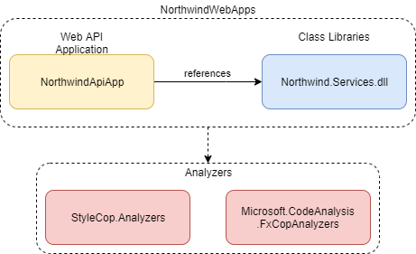
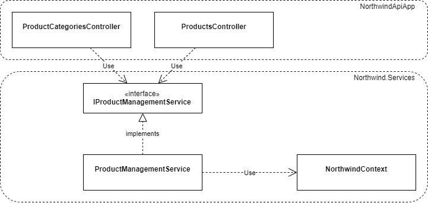
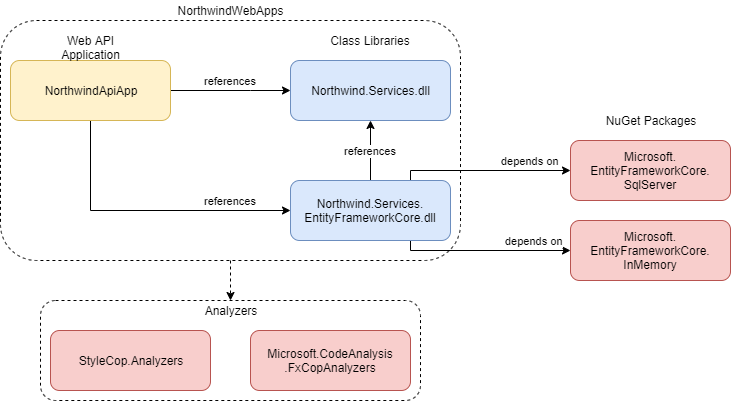
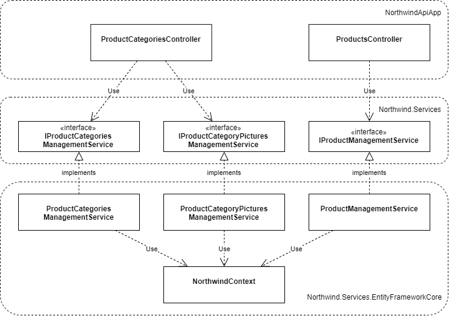
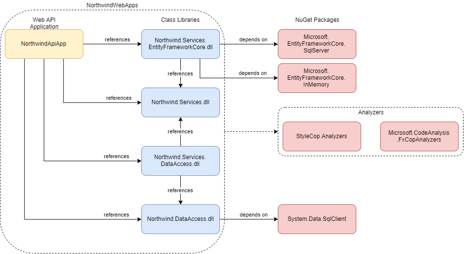
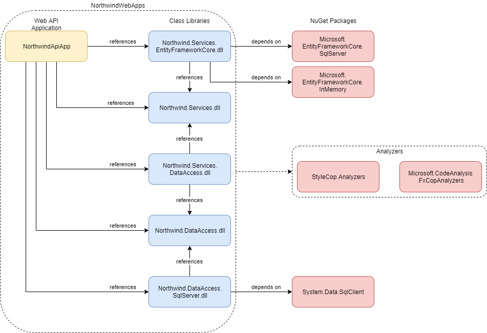

# Northwind Applications

## Модуль 4. Приложения Web API на ASP.NET Core

__Внимание!__ В этом модуле используется большое количество отдельных проектов. Это сделано для того, чтобы подчеркнуть зависимости между классами и сгруппировать классы в соответствии с выполняемыми функциями. Группировка классов в реальных проектах может происходить по другим критериям.


### Цель

* Научиться проектировать и разрабатывать приложения WebAPI при помощи ASP.NET Core.
* Научиться использовать ADO.NET для работы с базой данных.
* Научиться использовать async/await и TAP для IO-bound операций.


### Задание 1. ASP.NET Core Web API

Научитесь создавать простые _ASP.NET Core Web API_ приложения.

#### Выполнение

1. Пройдите интерактивное руководство [Create a web API with ASP.NET Core](https://docs.microsoft.com/en-us/learn/modules/build-web-api-net-core/).
2. Пройдите руководство [Tutorial: Create a web API with ASP.NET Core](https://docs.microsoft.com/en-us/aspnet/core/tutorials/first-web-api).


### Задание 2. Northwind Web API

Создайте приложение Web API с методами для управления товарами и категориями товаров.

#### Выполнение

1. Создайте решение _NorthwindWebApps_:



2. В проект _Northwind.Services_ добавьте файлы:

	* [Products\Product.cs](NorthwindWebApps/Northwind.Services/Products/Product.cs)
	* [Products\ProductCategory.cs](NorthwindWebApps/Northwind.Services/Products/ProductCategory.cs)
	* [Products\IProductManagementService.cs](NorthwindWebApps/Northwind.Services/Products/IProductManagementService.cs)
	* [Products\ProductManagementService.cs](NorthwindWebApps/Northwind.Services/Products/ProductManagementService.cs)

3. Зарегистрируйте сервис _ProductManagementService_ как реализацию интерфейса _IProductManagementService_ в _Startup.ConfigureServices_ с transient lifetime. См. [App startup in ASP.NET Core](https://docs.microsoft.com/en-us/aspnet/core/fundamentals/startup) и [Dependency injection in ASP.NET Core](https://docs.microsoft.com/en-us/aspnet/core/fundamentals/dependency-injection).
4. Добавьте новый контроллер _ProductCategoriesController_. Используйте [Constructor Injection](http://sergeyteplyakov.blogspot.com/2012/12/di-constructor-injection.html) для того, чтобы внедрить в контроллер зависимость на сервис _IProductManagementService_.
5. Заполните пустые колонки в таблице API методов для категорий.

| Operation        | HTTP Verb | URI                  | Request body | Response body |
| ---------------- | --------- | -------------------- | ------------ |  ------------ |
| Create           |           | /api/categories      |              |               |
| Read (all items) |           | /api/categories      |              |               |
| Read (item)      |           | /api/categories/{id} |              |               |
| Update           |           | /api/categories/{id} |              |               |
| Delete           |           | /api/categories/{id} |              |               |

6. Реализуйте все методы для _ProductCategoriesController_, используя методы интерфейса _IProductManagementService_. См. [Controller action return types in ASP.NET Core web API](https://docs.microsoft.com/en-us/aspnet/core/web-api/action-return-types).
7. Реализуйте в _ProductManagementService_ использованные методы интерфейса _IProductManagementService_. В качестве хранилища используйте in-memory database. Добавьте классы - контекст _NorthwindContext_ и необходимые сущности. Запустите приложение и проверьте работоспособность методов при помощи Postman.
8. Добавьте новый контроллер _ProductsController_, заполните пустые колонки в таблице API методов для товаров, реализуйте необходимые методы контроллера и сервиса.

| Operation        | HTTP Verb | URI                  | Request body | Response body |
| ---------------- | --------- | -------------------- | ------------ | ------------- |
| Create           |           |                      |              |               |
| Read (all items) |           |                      |              |               |
| Read (item)      |           |                      |              |               |
| Update           |           |                      |              |               |
| Delete           |           |                      |              |               |

9. Реализуйте в _ProductCategoriesController_ новые методы для управления картинкой (поток байтов) для категории. См. [Upload files in ASP.NET Core](https://docs.microsoft.com/en-us/aspnet/core/mvc/models/file-uploads), [IFormFile](https://docs.microsoft.com/en-us/dotnet/api/microsoft.aspnetcore.http.iformfile) и [ControllerBase.File](https://docs.microsoft.com/en-us/dotnet/api/microsoft.aspnetcore.mvc.controllerbase.file).

| Operation        | HTTP Verb | URI                                  | Request body    | Response body  |
| ---------------- | --------- | ------------------------------------ | --------------- | -------------- |
| Upload picture   | PUT       | /api/categories/{categoryId}/picture | Picture stream  | None           |
| Get picture      | GET       | /api/categories/{categoryId}/picture | None            | Picture stream |
| Delete picture   | DELETE    | /api/categories/{categoryId}/picture | None            | None           |

11. Проанализируйте зависимости:



12. Выделите из интерфейса _IProductManagementService_ интерфейсы для работы с категориями и картинками - _IProductCategoryManagementService_ и _IProductCategoryPicturesService_, перенесите в новые интерфейсы соответствующие методы, зарегистрируйте интерфейсы как сервисы и исправьте конструкторы соответствующих контроллеров. См. [I: Принцип разделения интерфейса](https://refactoring.guru/ru/didp/principles/solid-principles/isp).

13. Выделите методы класс сервиса _ProductManagementService_ в отдельные сервисы _ProductCategoryManagementService_ и _ProductCategoryPicturesService_. См. [S: Принцип единственной ответственности](https://refactoring.guru/ru/didp/principles/solid-principles/srp).

14. Добавьте библиотеку _Northwind.Services.EntityFrameworkCore_, исправьте зависимости на nuget-пакеты, перенесите в библиотеку код сервисов (_ProductManagementService_,  _ProductCategoryManagementService_, _ProductCategoryPictureService_) и все необходимые классы.



15. Проанализируйте зависимости:



16. Добавьте документацию для методов Web API. См. [Use web API conventions](https://docs.microsoft.com/en-us/aspnet/core/web-api/advanced/conventions).

17. Найдите в приложении Composition Root. См. [Using a DI Container in a Composition Root](https://freecontent.manning.com/dependency-injection-in-net-2nd-edition-understanding-the-composition-root/).


### Задание 3. Data Access Object

Добавьте в приложение функциональность по работе с базой данных. Реализуйте слой доступа к данным при помощи [паттерна DAO](http://javatutor.net/articles/j2ee-pattern-data-access-object). Для работы потребуется база данных [MS SQL LocalDB](use-localdb.md).

#### Выполнение

1. Добавьте в решение _NorthwindWebApps_ библиотеку _Northwind.DataAccess_, скопируйте [все классы в проект](NorthwindWebApps/Northwind.DataAccess).

2. Добавьте регистрацию сервисов:

```cs
services.AddScoped((service) =>
{.
    var sqlConnection = new SqlConnection(@"Data Source=(localdb)\MSSQLLocalDB;Initial Catalog=Northwind;Integrated Security=True;Connect Timeout=30;Encrypt=False;TrustServerCertificate=False;ApplicationIntent=ReadWrite;MultiSubnetFailover=False");
    sqlConnection.Open();
    return sqlConnection;
});

services.AddTransient<DataAccess.NorthwindDataAccessFactory, DataAccess.SqlServerDataAccessFactory>();
```
> Класс SqlConnection доступен в двух пространствах имен - System.Data и Microsoft.Data. Используйте класс System.Data.SqlConnection. Также, возможно использование пространства Microsoft.Data, однако в этом случае все другие классы проекта тоже должны использовать пространство Microsoft.Data вместо System.Data. См. [сообщение от vysotnikolay](https://github.com/epam-dotnet-lab/northwind-apps/issues/20). Также см. блог [Introducing the new Microsoft.Data.SqlClient](https://devblogs.microsoft.com/dotnet/introducing-the-new-microsoftdatasqlclient).

3. Добавьте новую библиотеку _Northwind.Services.DataAccess_.



4. В _Northwind.Services.DataAccess_ создайте новый сервис _ProductManagementDataAccessService_, который должен реализовывать интерфейсы _IProductManagementService_. Сервис должен использовать зависимость на _NorthwindDataAccessFactory_, чтобы получать данные из БД Northwind. Добавьте реализацию методов сервиса.

5. Измените регистрацию сервиса для интерфейса _IProductManagementService_, чтобы использовать сервис _ProductManagementDataAccessService_. Проверьте работоспособность приложения.

6. Добавьте в _Northwind.Services.DataAccess_ новый сервис _ProductCategoriesManagementDataAccessService_, реализуйте его, зарегистрируйте сервис. Проверьте работоспособность приложения.

7. Добавьте в _Northwind.Services.DataAccess_ новый сервис _ProductCategoryPicturesManagementDataAccessService_, реализуйте его, зарегистрируйте сервис. Проверьте работоспособность приложения.

8. Создайте новую библиотеку _Northwind.DataAccess.SqlServer_, отредактируйте проекты, чтобы изменить пакеты и ссылки на связанные проекты.



9. Перенесите код классов, которые отвечают за работу с БД MS SQL в _Northwind.DataAccess.SqlServer_.

10. Перенесите строку подключения к БД в конфигурационный файл. См. [Configuration in ASP.NET Core](https://docs.microsoft.com/en-us/aspnet/core/fundamentals/configuration/).


### Задание 4. Employees

#### Выполнение

1. Добавьте необходимые методы в _IEmployeeManagementService_.

2. Спроектируйте методы API для работы со списком сотрудников:

| Operation        | HTTP Verb | URI                  | Request body | Response body |
| ---------------- | --------- | -------------------- | ------------ | ------------- |
| Create           |           |                      |              |               |
| Read (all items) |           |                      |              |               |
| Read (item)      |           |                      |              |               |
| Update           |           |                      |              |               |
| Delete           |           |                      |              |               |


3. Добавьте новый контроллер _EmployeesController_, реализуйте методы.

4. Добавьте поддержку для DAO и in-memory database.

5. Реализуйте сервисы.


### Задание 5. Refactoring: Task Asynchronous Pattern

Научитесь применять async/await и Task Asynchronous Pattern для IO-bound операций (работа с БД).

#### Выполнение

1. Пройдите [Ultimate async / await Tutorial in C#](https://www.codingame.com/playgrounds/4240/your-ultimate-async-await-tutorial-in-c/introduction).
2. Прочитайте [Naming, parameters, and return types](https://docs.microsoft.com/en-us/dotnet/standard/asynchronous-programming-patterns/task-based-asynchronous-pattern-tap#naming-parameters-and-return-types).
3. Примените TAP для одного сценария, например, _получение списка категорий товаров_. Измените сигнатуру метода _IProductCategoryDataAccessObject.SelectProductCategories_ и переименуйте его:

```cs
Task<IList<ProductCategoryTransferObject>> SelectProductCategoriesAsync(int offset, int limit);
```

4. Измените реализации. Например, _ProductCategorySqlServerDataAccessObject_:

```cs
public async Task<IList<ProductCategoryTransferObject>> SelectProductCategoriesAsync(int offset, int limit)
{
    // ...
    return await this.ExecuteReaderAsync(commandText);
}
```

5. Скопируйте метод _ExecuteReader_ в _ExecuteReaderAsync_ и примените TAP:

```cs
private async Task<IList<ProductCategoryTransferObject>> ExecuteReaderAsync(string commandText)
{
    // ...
    using (var reader = await command.ExecuteReaderAsync())
    // ...
}
```

6. Измените сигнатуру _IProductCategoryManagementService.ShowCategories_ и переименуйте его:

```cs
Task<IList<ProductCategory>> ShowCategoriesAsync(int offset, int limit);
```

7. Измените реализации для _IProductCategoryManagementService.ShowCategoriesAsync_.
8. Измените соответствующий action для _ProductCategoriesController_.
9. Проверьте работоспособность endpoint. 

> Что-то пошло не так? Где-то пропущен await!

10. Примените TAP для всех actions всех контроллеров.
