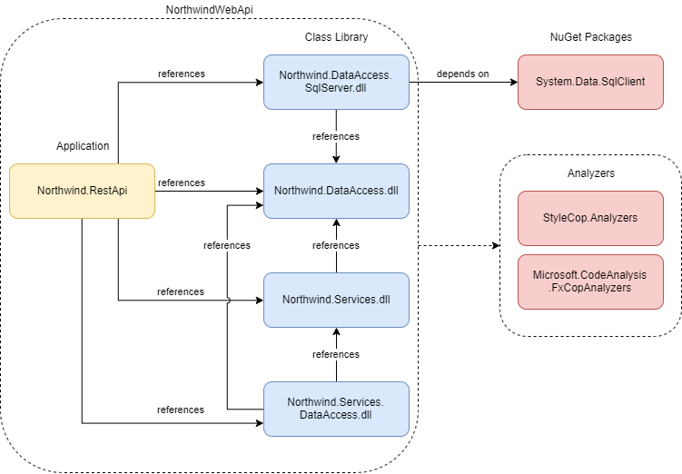

# Northwind Applications

## Модуль 4. Создание приложений WebAPI

### Цель

* Научиться проектировать и разрабатывать приложения WebAPI при помощи ASP.NET Core.
* Научиться использовать ADO.NET для работы с базой данных.

### Задание 1. ASP.NET Core

Научитесь создавать простые _ASP.NET Core Web API_ приложения.

#### Выполнение

1. Пройдите интерактивное руководство [Create a web API with ASP.NET Core](https://docs.microsoft.com/en-us/learn/modules/build-web-api-net-core/).
2. Пройдите руководство [Tutorial: Create a web API with ASP.NET Core](https://docs.microsoft.com/en-us/aspnet/core/tutorials/first-web-api).

#### Задание 2. LocalDB

Научитесь использовать базу данных LocalDB для разработки приложений.

#### Выполнение

1. Запустите _Visual Studio Installer_ и установите LocalDB:

2. Откройте вкладку _SQL Server Object Explorer_ и создайте новую базу данных _Northwind_.

3. Выберите _New Query_ в меню БД:

4. Вставьте текст скрипта для создания БД ([instnwnd.sql](https://github.com/microsoft/sql-server-samples/tree/master/samples/databases/northwind-pubs)) в окно запроса, выберите БД _Northwind_ и запустите скрипт на выполнение (_Execute_). Начало скрипта нужно пропутить до первого выражения CREATE TABLE.

#### Задание 3. Приложение Web API

#### Выполнение

1. 

1. Заполните колонку HTTP Verb в таблице:

| CRUD             | HTTP Verb | URI                  | Request body  | Response body           |
| ---------------- | --------- | -------------------- | ------------- | ----------------------- |
| Create           |           | /api/categories      | Category item | Category item           |
| Read (all items) |           | /api/categories      | None          | Array of category items |
| Read (item)      |           | /api/categories/{id} | None          | Category item           |
| Update           |           | /api/categories/{id} | Category item | None                    |
| Delete           |           | /api/categories/{id} | None          | None                    |

2. 

| CRUD             | HTTP Verb | URI                  | Request body  | Response body           |
| ---------------- | --------- | -------------------- | ------------- | ----------------------- |
| Create           |           | /api/categories      | Category item | Category item           |
| Read (all items) |           | /api/categories      | None          | Array of category items |
| Read (item)      |           | /api/categories/{id} | None          | Category item           |
| Update           |           | /api/categories/{id} | Category item | None                    |
| Delete           |           | /api/categories/{id} | None          | None                    |
