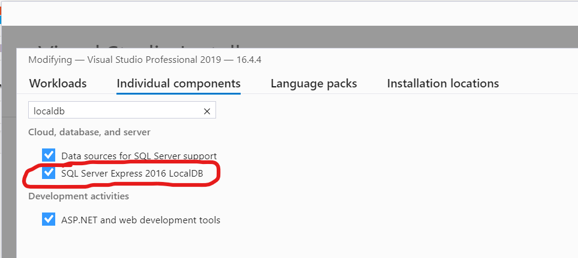
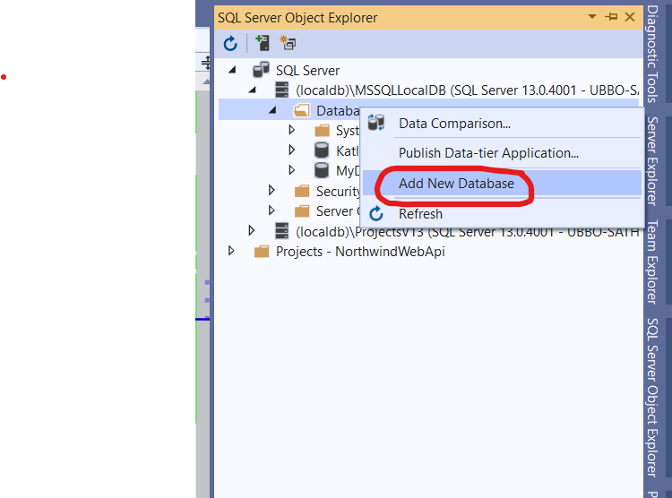
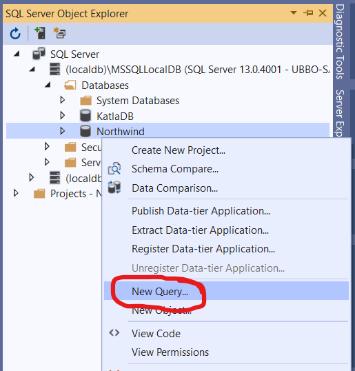
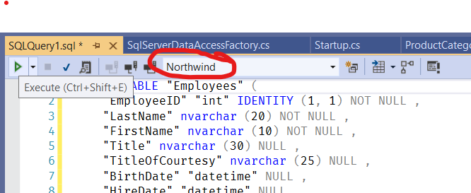

# Northwind Applications

## Работа с базой данных

### MS SQL LocalDB

1. Запустите _Visual Studio Installer_ и установите LocalDB:

2. Откройте вкладку _SQL Server Object Explorer_ и создайте новую базу данных _Northwind_.

3. Выберите _New Query_ в меню БД:

4. Вставьте текст скрипта для создания БД ([instnwnd.sql](https://github.com/microsoft/sql-server-samples/tree/master/samples/databases/northwind-pubs)) в окно запроса, выберите БД _Northwind_ и запустите скрипт на выполнение (_Execute_). Начало скрипта нужно пропутить до первого выражения CREATE TABLE.

